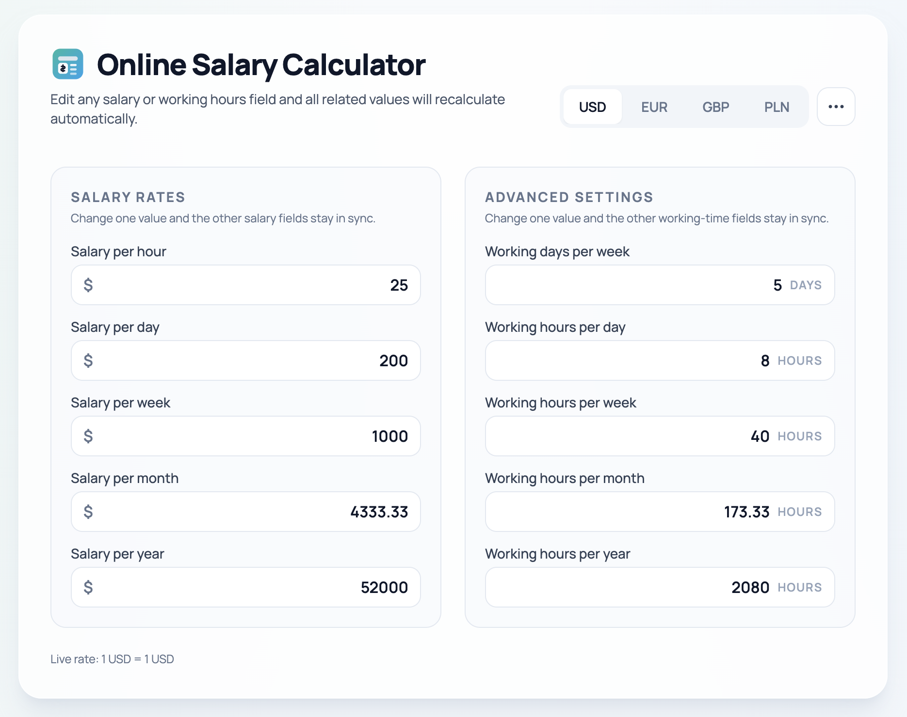

# Salary Calculator

Salary calculator built with Vite + React + TypeScript + Tailwind CSS.

The app recalculates salary values across periods (`hour`, `day`, `week`, `month`, `year`), supports currency switching with live rates, and includes advanced work schedule settings.

## Live Demo

[Salary Calculator](https://andkom.github.io/salary-calc)



## Features

- Real-time salary conversion between hourly, daily, weekly, monthly, and yearly values
- Currency switching with dynamic exchange rates (Frankfurter API)
- Quick currency tabs + searchable currency picker
- Advanced settings for:
  - Working days per week
  - Working hours per day/week/month/year
- Input sanitization and value limits to prevent invalid extreme values
- Responsive UI

## Tech Stack

- Vite
- React 18
- TypeScript
- Tailwind CSS
- Zustand
- ESLint + Prettier

## Development

### Option 1: Local Node.js

```bash
npm install
npm run dev
```

### Option 2: Docker (Node 22)

```bash
docker run --rm -it \
  -p 5173:5173 \
  -v "$PWD:/pwd" \
  -w /pwd \
  node:22 npm install

docker run --rm -it \
  -p 5173:5173 \
  -v "$PWD:/pwd" \
  -w /pwd \
  node:22 npm run dev
```

## Scripts

- `npm run dev` - start development server
- `npm run build` - production build
- `npm run preview` - preview production build
- `npm run typecheck` - TypeScript checks
- `npm run lint` - ESLint checks
- `npm run lint:fix` - auto-fix lint issues
- `npm run format` - Prettier format

## Build

```bash
npm run build
```

Build output is generated in `dist/`.

## License

This project is licensed under the MIT License. See the [LICENSE](./LICENSE) file for details.
